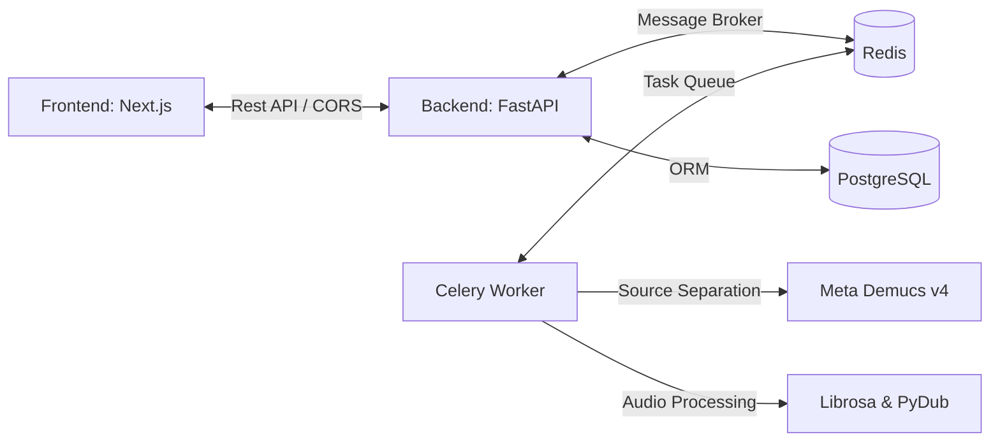

# 🎸 JustJam - AI-Powered Band Collaboration & Practice Platform

> **From individual practice stems to unified band vlogs, the smartest hub for bands.**
>
> 🔗 **Official Website**: [https://just-jam.vercel.app](https://just-jam.vercel.app)
> 🔗 **Backend API Server**: [https://justjam.onrender.com](https://justjam.onrender.com)

---

## 🎵 What is JustJam?

JustJam is an **AI-driven collaboration platform** built specifically for bands. 
It seamlessly bridges the gap between individual session practice and team coordination. Powered by advanced audio source separation (Demucs v4), it isolates instrument tracks so you can customize your practice environment. In addition, team members can verify their daily practices via video check-ins and merge them into a cohesive band vlog!

---

## 🚀 Key Features to Elevate Your Band Experience

### 1. 🎧 AI-Based Audio Source Separation (Stem Player)
* **Custom Mix Stem Player**: Upload your favorite track, and our AI will instantly isolate it into **Vocals, Drums, Bass, Guitar, Piano, and Other** stems.
* **Make Your Own Backing Tracks (MR)**: Mute specific sessions (like the guitar or bass line you play) or Solo your own track to practice along without tab sheets.
* **YouTube & Local File Imports**: Simply paste a YouTube video link or upload your own audio files (MP3/WAV) to begin separation.

### 2. 👥 Band Team Assembly & Instrument Assignment
* **Invite Bandmates**: Set up your band space and bring in your team.
* **Live Session Setup**: Assign roles (Vocals, Lead Guitar, Bass, Drums, Keyboard, etc.) to each member and keep track of everyone's practice status.

### 3. 🗓️ Setlog Practice Logs & Automatic Vlog Compilation
* **Practice Clip Trimmer & Text Overlay**: Upload a 15-second video clip of your practice, crop it down to a highlight 5-second window using our yellow iOS-style frame trimmer, and overlay a short note (up to 20 chars).
* **Auto-Vlog Merge**: When team members submit their 5-second logs, click a button to merge them into a single **Band Vlog** - perfect for sharing on Instagram Reels or YouTube Shorts!

---

## 🏁 Step-by-Step Onboarding for New Users

### Step 1: Sign in and Spawn Your Band
1. Go to [JustJam](https://just-jam.vercel.app) and sign in using Google or Kakao credentials.
2. Select **[Create New Team]** on your dashboard and name your band.
3. Invite your team members using the invite URL.

### Step 2: Claim Your Session Instrument
1. Find your card in the members sidebar on the right.
2. Select your designated instrument (e.g. `Guitar`, `Drums`, `Bass`) from the session list.

### Step 3: Add Songs and Split Stems
1. Click **[Add New Song]** inside your project room.
2. Provide a YouTube link or upload an audio file.
3. Once the AI source separation finishes, adjust the faders to mute/solo your part and jam!

### Step 4: Validate Your Practice with a 5s Vlog
1. After practicing, upload a recording of your performance.
2. Crop the best 5 seconds and type in a status message.
3. Once everyone uploads their clips, hit **[Merge Vlog]** to watch a compiled band memory.

---

## 🛠️ Technical Architecture & Stack

JustJam is optimized for heavy multi-track audio overlays and deep learning tasks.

- **Frontend**: Next.js 16 (App Router), Tailwind CSS, Vanilla CSS, Web Audio API, Sentry. (Hosted on Vercel)
- **Backend**: FastAPI (Python 3.10), SQLAlchemy. (Docker container hosted on Render)
- **Database & Queue**: PostgreSQL, Redis, Celery (optimized with `concurrency=1` for OOM protection).
- **Audio Engine**: Meta Demucs v4 (htdemucs_6s), Librosa, PyDub.
