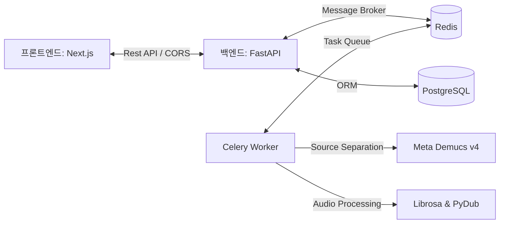

# 🎸 JustJam - AI 기반 스마트 합주 & 연습 플랫폼

> **합주의 시작부터 연습 인증까지, 밴드를 위한 가장 스마트한 공간.**
>
> 🔗 **공식 웹사이트**: [https://just-jam.vercel.app](https://just-jam.vercel.app)
> 🔗 **백엔드 API 서버**: [https://justjam.onrender.com](https://justjam.onrender.com)

---

## 🎵 JustJam이란 무엇인가요?

JustJam은 밴드 합주와 개인 파트 연습을 유기적으로 연결해주는 **AI 기반 스마트 합주 플랫폼**입니다. 
악기 파트별로 음원을 분리해주는 AI 기술(Demucs v4)을 탑재하여 나만의 연습실을 만들고, 합주 팀원들과 소통하며, 오늘 하루의 연습을 비디오로 인증하고 하나로 모으는 밴드 멤버들의 필수 허브입니다.

---

## 🚀 JustJam을 200% 즐기는 핵심 기능 가이드

### 1. 🎧 AI 스마트 음원 분리 (Audio Source Separation)
* **내 맘대로 믹싱하는 스템(Stem) 플레이어**: 음원을 업로드하면 AI가 **보컬, 드럼, 베이스, 기타, 피아노, 기타 악기** 등 최대 6개 스템으로 정밀하게 분리합니다.
* **나만을 위한 MR 만들기**: 특정 파트를 뮤트(Mute)하거나 해당 파트만 솔로(Solo)로 재생하여 가사나 악보 없이 귀로 들으며 완벽하게 합주 연습을 진행할 수 있습니다.
* **유튜브 & 로컬 파일 연동**: 가지고 있는 오디오 파일(MP3, WAV)은 물론, 연습하고 싶은 곡의 유튜브 링크만 입력하면 즉시 음원을 추출하고 분리합니다.

### 2. 👥 밴드 팀 결성 및 파트 지정 (Band Collaboration)
* **합주 멤버 초대**: 우리 밴드만의 팀을 만들고 멤버들을 초대하세요.
* **실시간 악기 포지션 세팅**: 멤버 각자가 담당하는 세션(보컬, 퍼스트 기타, 베이스, 드럼, 키보드 등)을 지정하고, 연습 진척도를 실시간으로 모니터링할 수 있습니다.

### 3. 🗓️ 셋로그(Setlog) 연습 인증 및 합주 Vlog 제작
* **연습 비디오 크롭 & 텍스트 오버레이**: 15초 분량의 개인 연습 영상을 업로드하고, iOS 스타일의 노란색 조절박스를 활용해 가장 핵심적인 5초 구간을 크롭하세요. 영상 위에 연습 날짜나 멘트(최대 20자)를 멋지게 입힐 수 있습니다.
* **자동 합주 Vlog 병합 (Auto-Vlog)**: 팀 멤버들이 올린 5초 연습 인증 영상들을 AI가 자동으로 이어 붙여 하나의 완성도 높은 **합주 Vlog 비디오**로 제작해 줍니다. 인스타그램 릴스나 유튜브 숏츠에 바로 올릴 수 있는 밴드 아카이브가 완성됩니다!

---

## 🏁 초보자를 위한 4단계 온보딩 (Step-by-Step)

### 1단계: 1초 만에 로그인하고 팀 만들기
1. [JustJam](https://just-jam.vercel.app)에 접속하여 구글 또는 카카오 계정으로 간편 로그인합니다.
2. 대시보드에서 **[새 팀 만들기]**를 클릭해 밴드 이름을 설정합니다.
3. 초대 링크를 통해 멤버들을 팀에 합류시킵니다.

### 2단계: 담당 악기 포지션 선택하기
1. 밴드 페이지 우측 멤버 목록에서 내 프로필을 찾습니다.
2. 드롭다운을 클릭하여 이번 합주에서 담당할 악기(예: `Bass`, `Drums`, `Guitar`)를 선택해 둡니다.

### 3단계: 연습곡 등록하고 AI 스템 분리하기
1. 팀의 프로젝트 공간에서 **[새 곡 추가]**를 누릅니다.
2. 연습하고 싶은 곡의 유튜브 링크를 넣거나 음악 파일을 업로드합니다.
3. AI 분리 작업이 완료되면, 재생 화면에서 내 파트 볼륨을 조절하며 나만의 연습(MR 재생)을 즐깁니다.

### 4단계: 오늘 하루 연습 5초 인증하고 Vlog 합치기
1. 개인 연습이 끝나면 스마트폰으로 촬영한 연습 비디오를 업로드합니다.
2. 5초 핵심 구간을 선택하고 "오늘 베이스 핑거링 연습 완료!"와 같은 텍스트를 입력해 저장합니다.
3. 모든 멤버가 인증을 마치면 **[합주 Vlog 생성]**을 눌러 멋지게 병합된 밴드 다이어리 영상을 감상합니다.

---

## 🛠️ 기술 아키텍처 & 스택

JustJam은 대용량 멀티트랙 오디오 오버레이와 비동기 딥러닝 연산을 위해 고도로 튜닝된 기술을 활용합니다.

- **Frontend**: Next.js 16 (App Router), Tailwind CSS, Vanilla CSS, Web Audio API, Sentry. (Vercel 배포)
- **Backend**: FastAPI (Python 3.10), SQLAlchemy. (Render Docker 배포)
- **Database & Queue**: PostgreSQL, Redis, Celery (OOM 가드 및 Concurrency=1 튜닝 완료).
- **Audio DSP**: Meta Demucs v4 (htdemucs_6s 모델), Librosa, PyDub.
