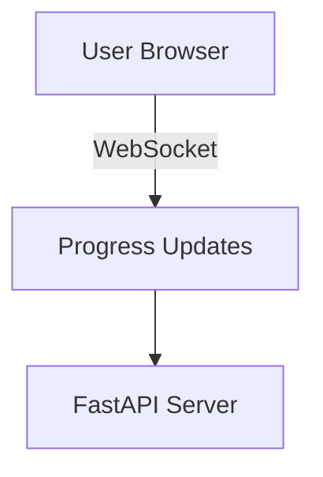

# [안티그래비티] Band-Mate AI 시스템 구조 설계

**문서 생성일:** 2026-01-15
**작성자:** Antigravity (AI Agent)
**목적:** 기존 Fingerstyle Tab MCP 프로젝트를 밴드 합주 및 연습을 위한 종합 웹 서비스 플랫폼(Band-Mate AI)으로 확장하기 위한 단계별 개발 로드맵 및 아키텍처 수립.

---

## 🏗 프로젝트 비전: Band-Mate AI
단순한 타브 악보 생성기를 넘어, **오디오 소스 분리(Source Separation)** 기술을 활용하여 연주자들이 각자의 파트(보컬, 드럼, 베이스, 기타, 건반)를 효과적으로 연습하고 합주를 준비할 수 있는 **Web 기반 플랫폼** 구축.

---

## 📅 개발 로드맵 (Phased Roadmap)

### Phase 1: Core Logic 완결성 확보 (현재 단계)
**목표:** MCP 환경을 테스트베드로 활용하여, 핵심 오디오 처리 엔진의 성능과 안정성을 극대화.
- [x] **Source Separation (음원 분리):** `htdemucs_6s` 모델 통합 (완료)
- [x] **Smart Cleaning:** 빈 트랙(Silence) 자동 감지 및 제거 로직 구현 (완료)
- [ ] **Tab Generation 고도화:**
    - 베이스 타브 정확도 개선 (4현 튜닝 최적화)
    - 기타 타브 "Playability" 지속 튜닝
- [ ] **Data Pipeline 표준화:** 입력(Audio) -> 처리(Separation/Transcription) -> 출력(Stems/Tabs/JSON Metadata) 구조 확립

### Phase 2: Local Web Service 전환 (Hybrid Architecture)
**목표:** 일반 사용자(밴드원)가 사용할 수 있는 "웹 인터페이스" 구축. 단, 무거운 연산 비용을 고려하여 우선 **Local-Hosted Web App** 형태로 개발.
- **Backend (FastAPI):**
    - 기존 `src/*` 로직을 API 엔드포인트로 래핑 (`/upload`, `/process`, `/stems/{id}`, `/tabs/{id}`)
    - 작업 큐(Background Tasks) 도입으로 장시간 처리(Demucs) 비동기화
- **Frontend (Next.js + React):**
    - **Dashboard:** 프로젝트(곡) 관리 및 업로드
    - **Practice Room (핵심):**
        - Multi-Track Mixer UI (각 파트별 볼륨/Mute/Solo 제어)
        - `WaveSurfer.js` 기반 파형 시각화
        - `AlphaTab` 연동 실시간 스크롤 악보 뷰어

### Phase 3: Cloud SaaS 배포 (Expansion)
**목표:** 검증된 로컬 앱을 클라우드 서비스로 확장하여 접근성 확대.
- **Infrastructure:**
    - GPU 인스턴스(AWS G4/G5 or Lambda GPU) 도입으로 처리 속도 향상
    - Storage(S3) 연동으로 대용량 음원 관리
- **Features:**
    - 사용자 계정 및 밴드 그룹 공유 기능
    - 모바일 반응형 최적화

---

## 📐 Phase 2 시스템 아키텍처 (제안)

```mermaid
graph TD
    Client[User Browser (Next.js)] -->|Upload Audio| API[FastAPI Server]
    Client -->|Control Mixer| API
    
    subgraph "Backend Core (Python)"
        API -->|Enqueue Task| Queue[Background Task Queue]
        Queue -->|Process| Engine[Audio Engine (Demucs/Transcriber)]
        
        Engine -->|Extract| Stems[WAV Files (Vocals, Drums, Bass...)]
        Engine -->|Generate| Tabs[JSON/ASCII Tabs]
    end
    
    subgraph "Storage (Local/S3)"
        Stems
        Tabs
        Metadata[Project DB (SQLite/JSON)]
    end
    
    API <--Serve Static--> Stems
    API <--Return Data--> Tabs
```

## ✅ Action Items (Immediate)

1.  **FastAPI 서버 스캐폴딩:** `src/api` 디렉토리 생성 및 기본 서버 구동.
2.  **API 명세서 작성:** 프론트엔드 통신을 위한 REST API 엔드포인트 정의.
3.  **Frontend 프로젝트 셋업:** `client` 폴더 내 Next.js 환경 구축.

---

## [Claude] 분석 후 개선방안

**분석일:** 2026-01-15
**분석자:** Claude (AI Assistant)

### 1. 문서 평가 요약

이 아키텍처 문서는 전반적으로 **잘 구성**되어 있으며, 기존 MCP 기반 프로젝트를 웹 서비스로 확장하려는 비전이 명확합니다. 다만 몇 가지 개선점과 현실적 고려사항을 제안드립니다.

---

### 2. 현재 프로젝트 현황 분석

#### 2.1 기존 코드베이스 구조
```
src/
├── audio_processor.py   # Demucs 기반 음원 분리 (htdemucs_6s)
├── config.py            # YAML 설정 관리
├── tab_generator.py     # 핑거스타일 타브 생성 엔진 (16KB)
└── transcriber.py       # Basic Pitch 기반 음원 분석 (12KB)
```

#### 2.2 이미 완성된 기능 (Phase 1 검증)
| 기능 | 상태 | 비고 |
|------|------|------|
| Source Separation (htdemucs_6s) | ✅ 완료 | `audio_processor.py`에서 처리 |
| Smart Cleaning (빈 트랙 제거) | ✅ 완료 | Silence detection 포함 |
| BPM 자동 감지 | ✅ 완료 | Librosa 기반 |
| 병렬 청크 처리 | ✅ 완료 | 45초 이상 파일 최적화 |
| 코드 인식 (40+ 코드 타입) | ✅ 완료 | CHORD_LIBRARY 구현 |
| Auto-Transpose | ✅ 완료 | C/G/D/A/E 키 자동 변환 |
| Polyphony 제한 | ✅ 완료 | 최대 3음 동시 연주 |
| 스마트 캐싱 | ✅ 완료 | 중복 처리 방지 |

---

### 3. 개선 제안사항

#### 3.1 Phase 1 미완료 항목 구체화 필요

문서에서 "Tab Generation 고도화"가 체크되지 않았는데, 구체적인 기준이 없습니다.

**제안:** 다음과 같이 측정 가능한 목표로 변경

```markdown
- [ ] **Tab Generation 고도화:**
    - 베이스 타브: 4현 베이스 튜닝(E1-A1-D2-G2) 전용 매핑 추가
    - 기타 타브: "Playability Score" 도입 (연속된 프렛 이동 거리 측정)
    - 목표: 평균 프렛 이동 거리 3프렛 이하
```

#### 3.2 Phase 2 아키텍처 보완

##### 3.2.1 누락된 컴포넌트 추가

현재 다이어그램에 **WebSocket** 지원이 없습니다. 실시간 처리 진행률 표시를 위해 필요합니다.



##### 3.2.2 작업 큐 기술 선택 명시

문서에서 "Background Tasks"를 언급했으나 구체적 기술이 없습니다.

**제안 옵션:**
| 옵션 | 장점 | 단점 |
|------|------|------|
| **Celery + Redis** | 산업 표준, 확장성 | 추가 인프라 필요 |
| **FastAPI BackgroundTasks** | 간단, 추가 설치 없음 | 단일 서버 한정 |
| **ARQ (async)** | 경량, async 친화적 | 생태계 작음 |

**권장:** Local 단계에서는 `FastAPI BackgroundTasks` → Phase 3에서 `Celery + Redis`로 마이그레이션

##### 3.2.3 Storage 전략 구체화

```yaml
# 제안하는 저장 구조
storage/
├── projects/
│   └── {project_id}/
│       ├── original.mp3          # 원본 오디오
│       ├── stems/
│       │   ├── vocals.wav
│       │   ├── bass.wav
│       │   ├── drums.wav
│       │   └── other.wav
│       ├── tabs/
│       │   ├── guitar.json       # 구조화된 타브 데이터
│       │   └── guitar.txt        # ASCII 타브
│       └── metadata.json         # BPM, 키, 처리 상태 등
```

#### 3.3 API 설계 보완

문서의 API 엔드포인트가 불완전합니다. 다음 엔드포인트 추가 제안:

```python
# 제안하는 REST API 명세
POST   /api/v1/projects                    # 프로젝트 생성 (업로드)
GET    /api/v1/projects                    # 프로젝트 목록
GET    /api/v1/projects/{id}               # 프로젝트 상세
DELETE /api/v1/projects/{id}               # 프로젝트 삭제

POST   /api/v1/projects/{id}/process       # 처리 시작
GET    /api/v1/projects/{id}/status        # 처리 상태 조회

GET    /api/v1/projects/{id}/stems/{stem}  # 스템 파일 다운로드
GET    /api/v1/projects/{id}/tabs          # 타브 조회
PUT    /api/v1/projects/{id}/tabs          # 타브 수정 (핑거링 조정)

# WebSocket
WS     /ws/projects/{id}/progress          # 실시간 진행률
```

#### 3.4 Frontend 기술 스택 보완

| 영역 | 제안 기술 | 근거 |
|------|----------|------|
| 상태관리 | **Zustand** | 경량, React Query와 궁합 |
| 서버 상태 | **TanStack Query** | 캐싱, 뮤테이션 자동화 |
| 오디오 재생 | **Howler.js** + WaveSurfer | 크로스브라우저 호환성 |
| 악보 렌더링 | **AlphaTab** | 타브 + 일반 악보 지원 |
| UI 프레임워크 | **shadcn/ui** | 커스터마이징 용이, Tailwind 기반 |

---

### 4. 리스크 및 고려사항

#### 4.1 기술적 리스크

| 리스크 | 영향도 | 대응 방안 |
|--------|--------|----------|
| Demucs GPU 메모리 부족 | 높음 | CPU 모드 폴백, 청크 사이즈 조정 |
| 긴 처리 시간 (3-5분/곡) | 중간 | 진행률 표시, 백그라운드 알림 |
| 브라우저 오디오 동기화 | 중간 | Web Audio API 정밀 제어 |

#### 4.2 Phase 2 → Phase 3 마이그레이션 고려

Local-first 설계 시 다음 사항을 미리 고려해야 Cloud 전환이 원활합니다:

- **파일 경로**: 절대 경로 대신 상대 경로 또는 스토리지 추상화 레이어 사용
- **설정 관리**: 환경변수 기반 설정 (`python-dotenv`)
- **데이터베이스**: SQLite → PostgreSQL 마이그레이션을 고려한 SQLAlchemy ORM 사용

---

### 5. 수정된 Action Items

기존 Action Items를 다음과 같이 구체화합니다:

#### Phase 2 준비 작업 (즉시 시작)

1. **프로젝트 구조 재정비**
   - `src/api/` 디렉토리 생성
   - `src/api/main.py` - FastAPI 앱 엔트리포인트
   - `src/api/routes/` - API 라우터 분리
   - `src/api/schemas/` - Pydantic 모델
   - `src/api/services/` - 비즈니스 로직 래핑

2. **API 서버 스캐폴딩**
   ```bash
   # 의존성 추가
   pip install fastapi uvicorn python-multipart aiofiles
   ```

3. **기존 로직 API화**
   - `mcp_server.py`의 도구들을 REST 엔드포인트로 래핑
   - 파일 업로드 핸들링 추가

4. **프론트엔드 환경 구축**
   ```bash
   npx create-next-app@latest client --typescript --tailwind --eslint
   cd client && npm install @tanstack/react-query wavesurfer.js
   ```

5. **OpenAPI 문서 자동 생성**
   - FastAPI의 `/docs` 엔드포인트 활용
   - 프론트엔드 타입 자동 생성 (`openapi-typescript`)

---

### 6. 결론

이 아키텍처 문서는 **좋은 출발점**이며, 기존 MCP 기반 핵심 로직이 이미 충분히 성숙했습니다. Phase 2 진입 전에 위에서 제안한 **API 설계 구체화**와 **기술 스택 확정**을 먼저 진행하는 것을 권장합니다.

**우선순위 권장:**
1. 🔴 API 엔드포인트 상세 설계 (OpenAPI 스펙)
2. 🟠 FastAPI 서버 스캐폴딩 + 기존 로직 래핑
3. 🟡 프론트엔드 프로젝트 초기 설정
4. 🟢 Practice Room UI 프로토타입

---

## 🛠 Master Development Checklist

### 1. Backend Foundation (FastAPI)
- [x] **Project Structure Setup**
    - [x] Create `src/api/` (main package)
    - [x] Create `src/api/routes/` (endpoints)
    - [x] Create `src/api/schemas/` (Pydantic models)
    - [x] Create `src/api/services/` (business logic)
- [x] **Dependencies**
    - [x] Add `fastapi`, `uvicorn`, `python-multipart`, `aiofiles` to requirements
- [x] **Server Bootstrap**
    - [x] Implement `src/api/main.py` (App Entry point, CORS, Middleware)
- [x] **Core API Implementation**
    - [x] Define API Schemas (Project, TaskStatus, etc.)
    - [x] Implement `POST /projects` (Upload Audio)
    - [x] Implement `POST /projects/{id}/process` (Trigger Analysis)
    - [x] Implement `GET /projects/{id}/status` (Process Monitoring)
    - [x] Implement `GET /projects/{id}/stems` (Download Stems)

### 2. Frontend Foundation (Next.js)
- [x] **Project Initialization**
    - [x] `npx create-next-app@latest client`
    - [x] Install dependencies (`zustand`, `tanstack-query`, `lucide-react`, `wavesurfer.js`)
- [x] **UI Components Setup**
    - [x] Install `shadcn/ui`
    - [x] Create basic Layout (Dark mode default)
- [x] **Core Pages**
    - [x] Dashboard (Project List)
    - [x] Project Detail (Practice Room Skeleton)

### 3. Integration & Polish
- [x] Integrate Audio Player (WaveSurfer)
- [x] Integrate Tab Viewer (Simple ASCII Viewer)
- [x] Integrate Sheet Music Viewer (OpenSheetMusicDisplay)
- [x] Optimize Source Separation Task (Async Background)
- [x] **New Features**
    - [x] Tab Generation (Guitar/Bass)
    - [x] Score Generation (MusicXML)
    - [x] MultiTrack Mixer

